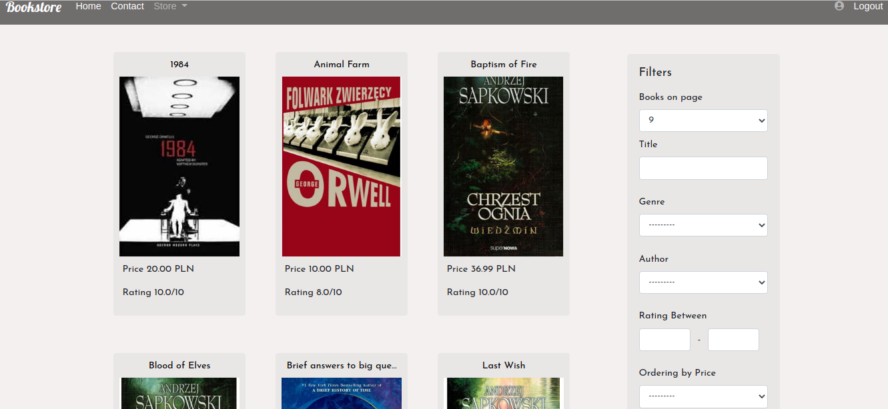

### BookStore -> SDA MiniProject

Project created in Django

    run with Docker (go to Bookstrore directory in Terminal):
    
    - docker-compose build
    - create superuser -> from bash e.g.:
        docker run -it bookstroe_web bash
    - docker compose up
    - panel admin -> create Group 'Moderators':
        * Moderators -> permissions to add and update Genre, Author, Book
        * stuff -> permissions to all above and delete
        * superuser -> all permissions
        * common user -> only browsing
    - http://127.0.0.1:8000/home
    - register and login (superuser must activate new user)

    or manually 

    - git clone <repo> .
    - virtualenv venv
    - source venv/bin/activate
    - pip install -r requirements.txt
    - python manage.py migrate
    - python manage.py loaddata books.json
    - create superuser !
    - panel admin -> create Group 'Moderators':
        * Moderators -> permissions to add and update Genre, Author, Book
        * stuff -> permissions to all above and delete
        * superuser -> all permissions
        * common user -> only browsing
    - python manage.py runserver
    - http://127.0.0.1:8000/home
    - register and login (superuser must activate new user)

Some screens:

 

